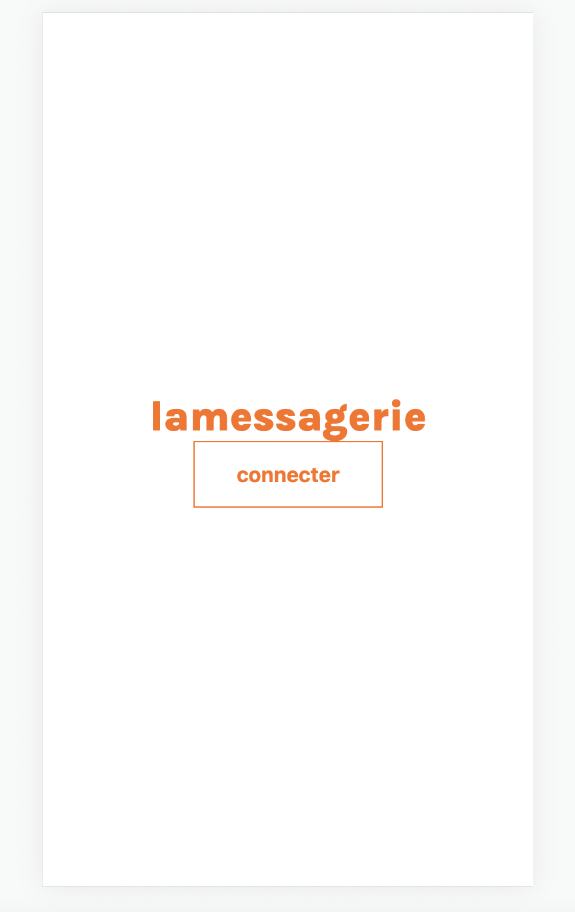
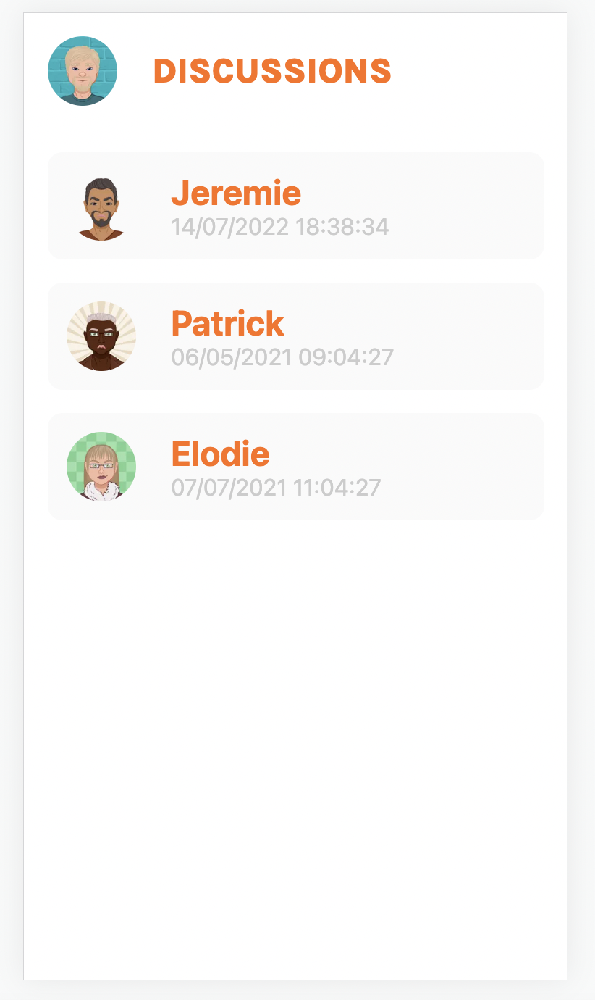
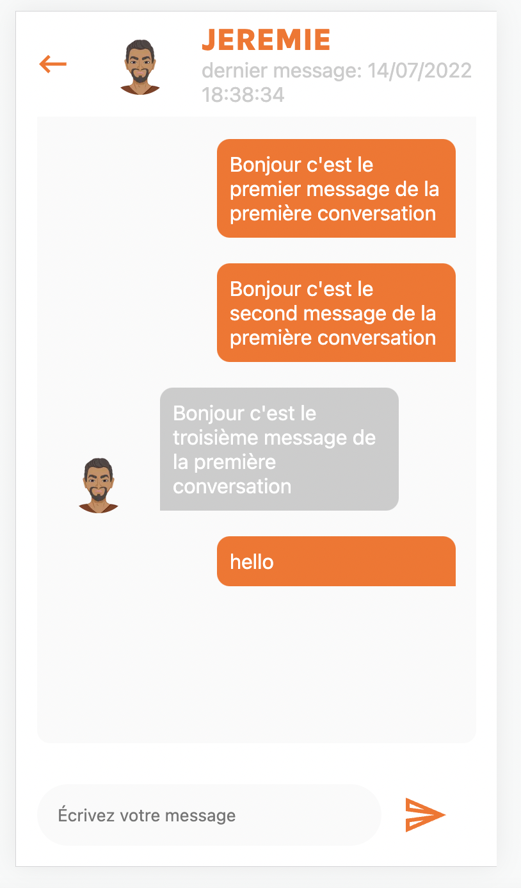

# Quick Start

## Installation :
1. Setup `.env`
```bash
cp .env.dist .env
```

2. Install
```bash
yarn
```

3. Start server
```bash
yarn start-server
```

4. Start app
```bash
yarn dev
```

# Features
- Display a list of all the conversations
- Allow the user to select a conversation
  - Inside the conversation, there is a list of all the messages between these two users.
  - As a user, you can type and send new messages in this conversation

# Explains
I wanted focus on the design and on a clean code

I created an conversation app messenger-like for the design with the colors of Leboncoin.

I have chosen the lib styled-components for two reasons:
- First, I discovered that lib during my last mission
- Second, that lib is going to be for next mission.

I have chosen framer motion to bring some motion design and I've been wanting to test it for a long time.

II have created a route on api to  be able to update the timestamp of the
conversation. 

I have updated the middleware, so that it can retrieve one unique conversation from its id.

I have used fs.readFile  to read the file
db.json everytime  I make a request, which can update the last datas in app.

# Screenshoots




# Update next time
- button morphing on the add conversation (I miss time...)

